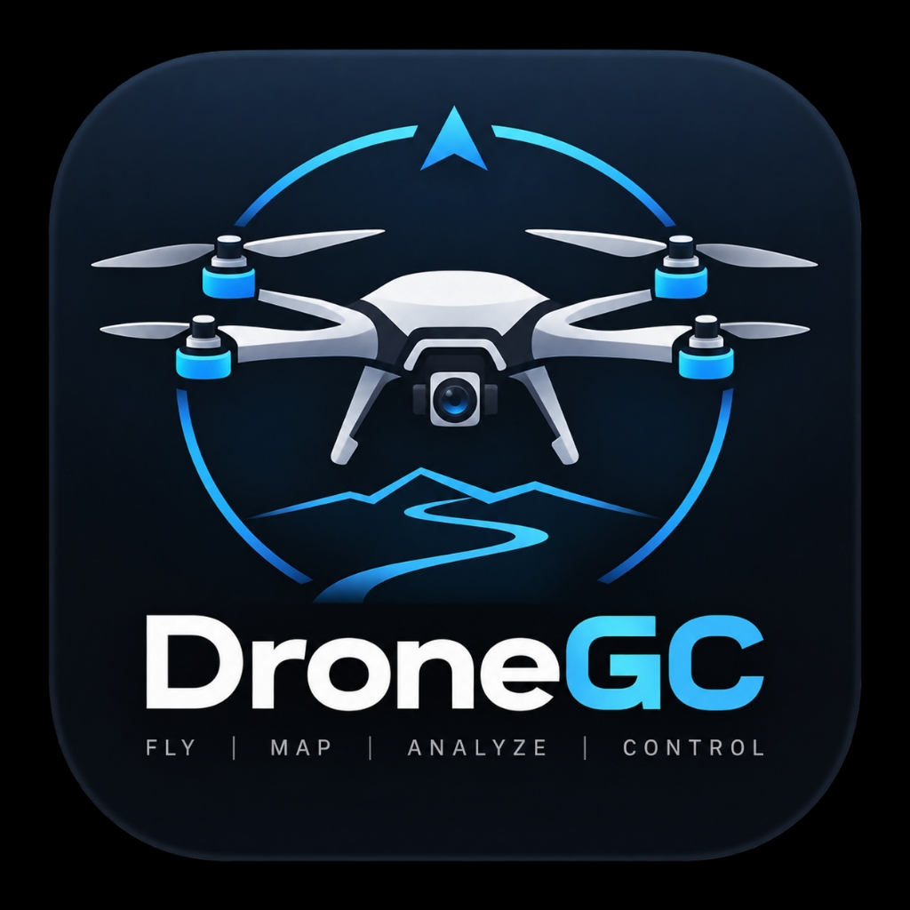

<div align="center">



# 🛸 DroneGCS

### Tactical Multi-UAV Ground Control Station
**Engineered for Autonomous UAV Operations, Fleet Telemetry, and Real-Time Mission Execution**

[](LICENSE)
[](https://github.com/Humobot1812/DroneGCS)
[](https://www.qt.io/)
[](https://isocpp.org/)
[](https://mavlink.io/)

<p align="center">
  <a href="#key-features">Key Features</a> •
  <a href="#system-architecture">Architecture</a> •
  <a href="#quick-start">Quick Start</a> •
  <a href="#building-from-source">Building from Source</a> •
  <a href="#appimage-packaging">AppImage Packaging</a> •
  <a href="#developer">Developer</a> •
  <a href="#license">License</a>
</p>

</div>

---

## 📌 Overview

**DroneGCS** is a high-performance, tactical Ground Control Station (GCS) designed from the ground up for modern multi-rotor, fixed-wing, and VTOL uncrewed aerial vehicles. Built with **C++17**, **Qt 6**, **QML**, and **MAVLink v2**, DroneGCS delivers an ultra-responsive, military-inspired cockpit interface with millisecond telemetry latency, interactive geospatial situational awareness, live HD video pipelines, and an autonomous mission planner.

Whether bench-testing flight controllers (Pixhawk, Cube, ArduPilot, PX4) via USB/Telemetry Radios, connecting to Software-in-the-Loop (SITL) simulators over TCP/UDP, or managing multi-vehicle field operations, DroneGCS provides total command and telemetry oversight.

---

## ✨ Key Features

### 🛩️ Multi-Drone Fleet & Swarm Management
* **Multi-Vehicle Support**: Connect, track, and command multiple drones concurrently with independent telemetry streams.
* **Instant Vehicle Switching**: Seamlessly toggle active control between airframes via the fleet selector bar.
* **Live Fleet Status Overview**: At-a-glance monitoring of battery state, flight modes, satellite lock, and comms links across all active vehicles.

### 🧭 Tactical Glass Cockpit & HUD
* **Primary Flight Display (PFD)**: High-fps Artificial Horizon / Attitude Indicator with pitch ladder and roll scale.
* **Vertical Tape Gauges**: Real-time indicated airspeed, groundspeed, barometric altitude, and climb rate (variometer).
* **Compass Rose**: Dynamic heading tape with home vector, target waypoint bearing, and ground track visualization.
* **Subsystem Vital Signs**: Cell-by-cell battery monitoring, link signal quality (RSSI), GPS fix type (3D/RTK), satellite count, and HDOP/VDOP metrics.

### 🗺️ Geospatial Tactical Map Engine
* **Interactive Mapping**: Powered by an embedded Leaflet/WebEngine core with seamless tile switching (OpenStreetMap, Satellite Imagery, Dark Tactical, Terrain).
* **Dynamic Vehicle Markers**: Real-time heading-aligned aircraft icons, home position markers, and animated breadcrumb trails.
* **Interactive Waypoint Editor**: Point-and-click waypoint sequencing with altitude, speed, acceptance radius, and loiter time controls.
* **Survey & Grid Missions**: Automated flight path generation for aerial mapping and reconnaissance.
* **Mission Elevation Profile**: Interactive elevation and flight profile chart showing planned trajectory vs terrain.

### ⚡ Universal 1-Click Auto-Connect
* **Comprehensive Multi-Transport Scanning**:
  * **Serial**: Automatically detects and prioritizes flight controller interfaces (`/dev/ttyACM*`, `/dev/ttyUSB*`, FTDI, SiK radios) at 57600/115200 baud.
  * **UDP**: Listens concurrently across all standard MAVLink telemetry ports (`14550`, `14551`, `14552`, `18570`).
  * **TCP**: Probes ArduPilot/PX4 SITL simulator endpoints (`127.0.0.1:5760`, `5761`, `5762`, `14550`).
* **Visual Diagnostics**: Real-time status matrix showing connection results for every scanned port.

### 🛡️ Safety, Geofencing & Pre-Flight Diagnostics
* **Interactive Geofence Console**: Configure circular and polygonal keep-in/keep-out safety boundaries with ceiling and floor constraints.
* **Slide-to-Confirm Arming**: Safeguarded tactile sliders for critical flight commands (Arm, Disarm, Takeoff, Return-to-Launch, Land, Emergency Kill).
* **Pre-Flight Checklist Engine**: Interactive pre-arm verification covering IMU calibration, GPS lock, battery threshold, RC link, and motor test.
* **Spoken Voice Annunciator**: Auditory callouts for critical flight events (Arming state, flight mode changes, battery warnings, geofence violations).

### 📊 Real-Time Analytics & Flight Log Replay
* **Live Telemetry Grapher**: Multi-channel real-time charting for altitude, airspeed, battery voltage, current draw, pitch, roll, and vibration.
* **Flight Playback**: Review and analyze historic missions with variable-speed playback, scrub bar, and telemetry telemetry overlays.
* **AI Copilot & Advisor**: Integrated situational intelligence providing operational alerts and advisory telemetry insights.

### 📹 Live HD Video Pipeline
* **GStreamer Integration**: Ultra-low-latency video reception supporting RTSP, UDP RTP, and H.264 video streams.
* **Picture-in-Picture (PiP)**: Draggable, floating video overlay directly over the tactical map.

---

## 🏗️ System Architecture

```
┌────────────────────────────────────────────────────────────────────────┐
│                        DroneGCS User Interface                         │
│   Dashboard HUD  │  Tactical Map  │  Mission Planner  │  Video & Logs  │
├────────────────────────────────────────────────────────────────────────┤
│                       Qt 6 / QML Presentation Layer                     │
│    Quick Controls 2 (Material Dark)  │  Custom Canvas / SVG Visuals    │
├───────────────────────┬────────────────────────┬───────────────────────┤
│    Telemetry Grapher  │  Geofence & Safety     │  Voice Annunciator    │
├───────────────────────┴────────────────────────┴───────────────────────┤
│                           C++17 Core Engine                            │
│  ┌────────────────────┐ ┌────────────────────┐ ┌─────────────────────┐ │
│  │   DroneManager     │ │   DroneVehicle     │ │   MissionPlanner    │ │
│  │  Fleet Management  │ │  Telemetry & State │ │  Waypoint & Plans   │ │
│  └─────────┬──────────┘ └─────────┬──────────┘ └──────────┬──────────┘ │
├────────────┼──────────────────────┼───────────────────────┼────────────┤
│   Transport Subsystem │ MAVLink v2 Parser/Serializer      │ Video Subsys│
│   Serial (ttyACM/USB) │ HEARTBEAT, ATTITUDE, GLOBAL_POS   │ GStreamer  │
│   UDP (14550/14551..) │ MISSION_ITEM_INT, COMMAND_LONG    │ RTSP / UDP │
│   TCP (5760/5761..)   │ SYS_STATUS, VFR_HUD, BATTERY_STAT │ H.264 / PiP│
└───────────────────────┴───────────────────────────────────┴────────────┘
```

---

## 🚀 Quick Start

### Running the AppImage (Recommended)

DroneGCS is distributed as a completely self-contained Linux AppImage with zero system Qt dependencies:

```bash
# 1. Download or locate DroneGCS.AppImage
chmod +x DRONE_GCS-x86_64.AppImage

# 2. Grant serial port permissions (required for USB flight controllers)
sudo usermod -aG dialout $USER

# 3. Launch DroneGCS
./DRONE_GCS-x86_64.AppImage
```

> **Note**: After adding yourself to the `dialout` group, log out and log back in once for the permissions to take effect.

---

## 🛠️ Building from Source

### Prerequisites

* **Operating System**: Linux (Ubuntu 20.04 / 22.04 / 24.04 or compatible)
* **Compiler**: GCC / G++ supporting C++17
* **Build System**: CMake (>= 3.16) & Make / Ninja
* **Framework**: Qt 6 (6.2.4 or higher) with components:
  * `Core`, `Gui`, `Quick`, `Qml`, `Network`, `SerialPort`, `WebEngineQuick`
* **Multimedia**: GStreamer 1.0 development libraries

Install the required system packages:
```bash
sudo apt-get update
sudo apt-get install -y \
    build-essential \
    cmake \
    git \
    libgstreamer1.0-dev \
    libgstreamer-plugins-base1.0-dev \
    gstreamer1.0-plugins-good \
    gstreamer1.0-plugins-bad \
    libnss3 \
    libxcomposite-dev \
    libxdamage-dev \
    libxrandr-dev \
    libxcursor-dev \
    libxi-dev \
    libxtst-dev
```

### Compiling

```bash
# Clone the repository
git clone https://github.com/Humobot1812/DroneGCS.git
cd DroneGCS

# Run the automated build script (points to Qt 6.2.4 or your Qt installation)
./build.sh

# Or build manually with CMake:
mkdir -p build && cd build
cmake .. -DCMAKE_PREFIX_PATH="$HOME/Qt/6.2.4/gcc_64" -DCMAKE_BUILD_TYPE=Release
cmake --build . --parallel $(nproc)

# Run the binary
./DRONE_GCS
```

---

## 📦 AppImage Packaging

DroneGCS includes a complete, standalone AppImage packaging toolchain with bundled Chromium WebEngine runtime, Qt plugins, and OpenSSL libraries:

```bash
# Generate the standalone AppImage
./scripts/create_appimage.sh

# The output AppImage will be generated at:
# build/DRONE_GCS-x86_64.AppImage
```

---

## 🔌 Connecting to Vehicles

| Connection Type | Default Parameters | Typical Target |
|:---|:---|:---|
| **USB Serial** | `/dev/ttyACM0`, `57600` / `115200` baud | Pixhawk, Cube, Matek, ArduPilot / PX4 via USB |
| **Telemetry Radio** | `/dev/ttyUSB0`, `57600` baud | SiK Radio, Holybro, RFD900, 3DR Radio |
| **UDP Inbound** | Port `14550` or `14551` | Companion computers (Raspberry Pi), MAVProxy, SITL |
| **TCP Client** | `127.0.0.1:5760` | ArduPilot SITL simulator instance 0 |

Click **⚡ Auto-Connect** in the connection dialog to probe and attach to available vehicles on all interfaces simultaneously.

---

## 👨‍💻 Developer

**Abhinav Goel**  
*Drone Systems Engineer · Ground Control Station Developer*

* 🌐 **Website**: [humobot1812.github.io/Portfolio](https://humobot1812.github.io/Portfolio/)
* 💼 **LinkedIn**: [abhinav-g-1b878a2b5](https://www.linkedin.com/in/abhinav-g-1b878a2b5/)
* 🐙 **GitHub**: [@Humobot1812](https://github.com/Humobot1812)
* 📧 **Email**: [abhinav.goel.robotics@gmail.com](mailto:abhinav.goel.robotics@gmail.com)
* 📁 **Repository**: [Humobot1812/DroneGCS](https://github.com/Humobot1812/DroneGCS)

---

## 📄 License

This project is licensed under the **MIT License** — see the [LICENSE](LICENSE) file for complete details.

```
Copyright (c) 2026 Abhinav Goel
```
